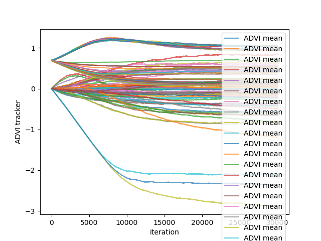
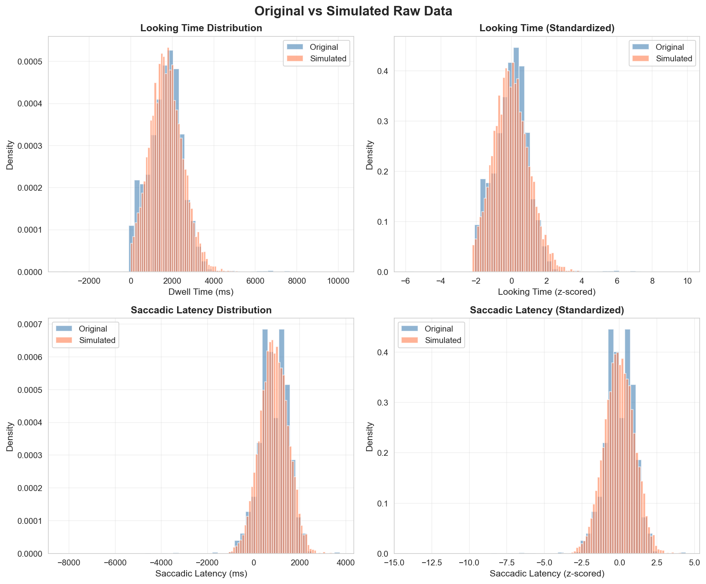
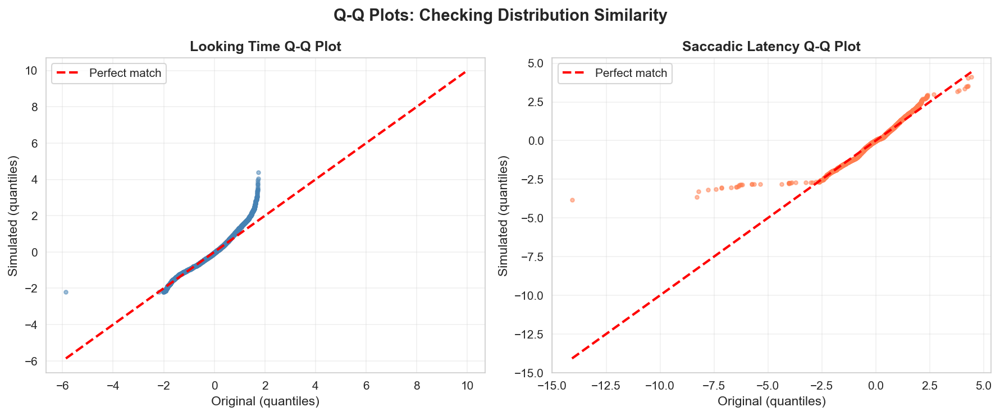

### Links

[Project Repository](https://github.com/psyc-201/poli2024)

[Project Code](https://github.com/psyc-201/poli2024/tree/main/code)

[Original Paper](https://github.com/psyc-201/poli2024/blob/main/original_paper/Poli2023DevSci.pdf)

[Original Data Repository](https://osf.io/zux9v/overview)

## Introduction

One way to measure infants' learning is through their gaze. Poli et al. (2024) used a hierarchical Bayesian modeling approach to identify individual differences in infants' looking during a novel visual learning (VL) task, in which information-theoretic measures (i.e., **predictability** and **information gain**) can be derived (for a full description of the informational structure in the task, see Poli et al., 2020).

The model is fitted to infants' looking behavior (look-aways, looking time, and saccadic latency) in the task to infer the values of latent parameters that serve as a proxy for specific cognitive functions: **processing speed**, **learning performance**, **curiosity**, and **sustained attention** (see Figure 1).

The current project is a (partial, see Figure 1) reproduction of the analytic pipeline in Poli. 2024.

[](https://doi.org/10.1111/desc.13460)

### Aims

**(1)** Reproduce the individual-level findings for learning performance and curiosity using the original data with automatic differentiation variational inference (ADVI).

**(2)** Simulate infant looking behavior in the visual learning task from the posterior distribution of the original data (e.g., use individual latent parameters from the original data to generate a simulated dataset of infant looking times) for 145 infants.

**(3)** Fit the original HBM to the simulated dataset to estimate the latent parameters of interest: **learning performance** and **curiosity** (information gain x looking time).

**(4)** Compare model fit and analyses from simulated data to the original data by indexing the number of infants who display significant coefficients for learning performance and curiosity from (1) the original data using MCMC (see below), (2) the original data using ADVI, and (3) the simulated data using ADVI.

*I aim to reproduce the following as indexed by 89% credible intervals different from zero (where zero indicates lack of an effect) with both the original and the simulated data using ADVI:*

-   **Learning Performance (saccadic latency x predictability)**: approximately 57 infants (40%) with a significant coefficient.

-   **Curiosity (looking time x information gain)**: approximately 31 infants (22%) with a significant coefficient.

**Key analysis of interest**: [**Posterior predictive check (PPC) to validate a hierarchical Bayesian model of infant attention during a probabilistic learning task**]{.underline}. Specifically, testing whether the model can (1) generate realistic data matching observed distributions of looking time and saccadic latency, and (2) recover known parameters when fitted to simulated data, thereby confirming the model adequately captures infant learning behavior.

## Methods

### **Model Reproduction:**

I replicated the hierarchical Bayesian model (HBM) from Poli et al. (2024). The original study used PyMC3 with Markov Chain Monte Carlo (MCMC) sampling; I adapted the model to PyMC v5 and used Automatic Variational Inference (ADVI) for computational efficiency.

The [original dataset](https://osf.io/zux9v/overview) consisted of 145 infants contributing 9,298 trial-level observations. Three dependent variables were analyzed: looking time (z-scored dwell duration), saccadic latency (z-scored), and look-away events (binary indicator of disengagement). Independent variables included the z-scored information theoretic-measures of interest: predictability (negative entropy of a given trial) and information gain (KL-divergence of the newest observation).

The hierarchical model structure included two levels: population-level hyperparameters and individual-level parameters (see code block below). **This project focused on replicating the individual-level parameters thought to reflect learning performance (β₁\^SL: the correlation between predictability and saccadic latency) and curiosity (β₁\^LT: the correlation between information gain and looking time).** Just as in the original paper, looking time and saccadic latency were modeled using Student's T likelihood distributions, and weakly informative priors were specified: normal distributions for individual-level parameters.

``` python
posterior=pd.DataFrame()
posterior["subjnum"]= markasgood.values.reshape(-1, )
posterior["LT0"]=np.median(trace["LT0"], axis=0)  # Processing speed (looking time)
posterior["LT1"]=np.median(trace["LT1"], axis=0)  # Curiosity
posterior["SL0"]=np.median(trace["SL0"], axis=0)  # Processing speed (saccadic)
posterior["SL1"]=np.median(trace["SL1"], axis=0)  # Learning performance
posterior["lambda0"]=np.median(trace["lambda0"], axis=0)  # Sustained attention
posterior["beta_LA"]=np.median(trace["beta_LA"], axis=0)  # (not used in main analysis)
posterior.to_csv('posterior_median.csv')
```

ADVI optimization ran for 30K observations, after which 50K samples were drawn from the approximate posterior distribution. I monitored convergence through Evidence Lower Bound (ELBO) plots that tracked the evolution of posterior means and standard deviations across iterations (Figure 2).

### **Posterior Predictive Check:**

Following the model reproduction, I conducted a two-part posterior predictive check (PPC) to validate the model's ability to capture realistic patterns in infants' looking data.

**Simulation and Distributional Fit**: I used the posterior means from the reproduced model fit (found in [gen_summary_rep.csv](https://github.com/psyc-201/poli2024/blob/main/code/mini%20model/gen_summary_rep.csv)) as true parameter values to generate simulated data matched the structure of the observed dataset. I simulated 9,298 trials by drawing from the Student's T distributions for looking time and saccadic latency (as did the original authors), and preserving the original missingness structure. I evaluated distributional fit through q-q plots, overlaid histograms, and basic summary stats.

**Parameter Recovery**: I re-fit the identical model structure to the simulated dataset using ADVI with the same specifications as the original reproduction to test whether I could accurately recover known parameter values. I evaluated individual-level parameters by comparing the proportion of infants showing significant effects across original and recovered datasets. As in the original study, parameters were classified as statistically significant when their 89% credible interval excluded zero, indicating 89% confidence the parameter reflects a reliable effect. This threshold was applied to identify and recover infants demonstrating individual differences in learning performance and curiosity.

## Results

```{r include=T}
### All code can be found in the folder labeled code 
### Original code is in code/original model
### Project code is in code/mini model
```

### **Model Reproduction**

The ADVI optimization successfully converged after 30K iterations (Figure 2) based on stabilization of the ELBO plot (Figure 2). The reproduction yielded similar individual-level parameter estimates to the original MCMC results, validating ADVI as a computationally efficient alternative for this hierarchical model.

{alt="Figure 2. Convergence plot after fitting model over full dataset."}

### **Posterior Predictive Check**

The simulated data closely matched the distributional properties (Figure 3) of the original data in Poli et al. (2024). Quantile-quantile plots showed simulated values aligned with the diagonal across the full range of both looking time and saccadic latency measures, indicating that the model successfully captured the shape of the data-generating distribution. Both the original and the simulated datasets exhibited means near zero and standard deviations near one.

{fig-align="left"}

{fig-align="left"}

### **Individual-Level Parameter Recovery**

##### ***\*Original Data w/ MCMC:*** 

In the original paper, Poli and collegues identified 57 infants (40%) with a significant coefficient for learning performance (predictability x saccadic latency) as indexed by 89% credible intervals different from zero. 31 infants (22%) had a significant coefficient for curiosity (information gain x looking time).

\*Values are reported as found in the original paper. Percentages are presumably rounded.

##### [***Original Data w/ ADVI:***](https://github.com/psyc-201/poli2024/blob/main/code/mini%20model/advi_analysis_rep.csv)

Using the original data with ADVI, I identified approximately 63 infants (43.45%) with a significant coefficient for learning performance. 40 infants (27.59%) had a significant coefficient for curiosity.

##### [***Simulated Data w/ ADVI:***](https://github.com/psyc-201/poli2024/blob/main/code/mini%20model/advi_analysis_sim.csv) 

Using simulated data with ADVI, I identified approximately 65 infants (44.83%) with a significant coefficient for learning performance and 51 infants (35.17%) with a significant coefficient for curiosity.

## Discussion

The primary aim of this project was to reproduce the individual differences found in infants' learning performance and curiosity during a visual learning task using a hierarchical Bayesian model (Poli et al., 2024). To validate the model, I completed a posterior predictive check by assessing whether the model could generate realistic data matching observed distributions of looking time and saccadic latency, and whether it could recover known individual-levels parameters when fitted to simulated data.

At the individual level, parameter recovery (simulated data with ADVI) preserved the overall pattern of significance for learning performance; approximately 43% of infants showed a significant coefficient compared to 40% in the original study. For curiosity effects, however, over 35% of infants showed a significant coefficient compared to just 22% in the original study. This difference in reproducibility could be driven by group-level differences between learning performance and curiosity; curiosity has a smaller group effect (mu_LT1 = 0.05 - 0.08) than learning performance (mu_SL1 \~ -0.11 to -0.13), making it more vulnerable to inference method differences (i.e., MCMC vs ADVI). It's also possible that variance was underestimated using ADVI, making individual effects appear more certain than they actually are. If true, using the ADVI posterior means as the "true" values and re-fitting with ADVI would compound the bias. It will be important to perform a direct reproduction using MCMC in the future to rule out whether my result for the curiosity parameter is driven by an approximation limitation.

The model makes several assumptions worth noting. First, it assumes saccadic latency responds linearly to predictability (entropy), and that looking time responds linearly to information gain (KL-divergence). The latter raises important questions about the appropriate way to conceptualize and quantify curiosity. Since the model specifies one LT1 value per infant and relates it to all subsequent trials, it assumes that infants' curiosity is a static trait, though presumably infants' curiosity fluctuates (and likely degrades) as the task progresses.

One limitation emerged in the simulation process: the Student's T likelihood generated negative dwell values (2.9% of non-missing observations), compared to only 6 (0.09%) in the original data. Since that's biologically implausible, I chose to filter these to missing. It's true that the Student's T distribution provides robustness to outliers through its heavy tails, but these same heavy tails can generate extreme values beyond realistic bounds for looking measures. In future iterations of this analysis pipeline, I would like to try modeling the log-transformed looking times with a normal distribution.

Also worthy of consideration is that fact that, across 9K+ observations (i.e., all individual trials across infants), there were over 2K missing or NaN values (nearly 24.2%). This initially presented as a limitation, but the simulation revealed that it accurately reflects lapses in infant attention or disengagement that are informative to the cognitive processes of interest. I preserved the missingness structure in the simulation and successfully recovered parameters despite it, demonstrating that the HBM framework can appropriately the inevitable discrepancies in infants' looking data.

This simulation was highly informative of the hierarchical Bayesian modeling process, which I intend to use to extract individual differences with the same paradigm in a new set of infants. Validating the model with simulated data serves as both a proof of concept and feasibility for my ongoing, in-person replication.
